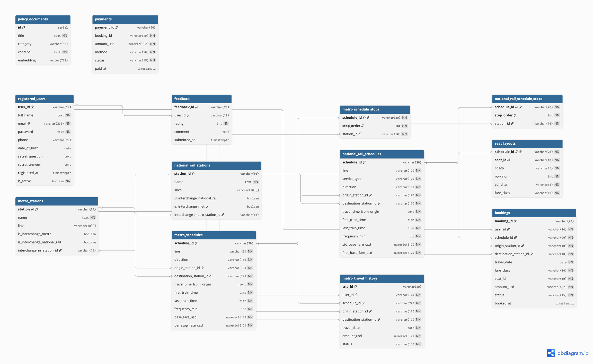

# TransitFlow — 資料庫設計文件

> IM2002 期末專題 | 第 41 組
> 蔡晟郁 · 黃謙儒 · 蔣耀德

---

# Section 1 — 實體關係圖

> 負責人：蔡晟郁

## 1.1 ER 圖



[ER Diagram（PDF 版）](er-diagram.pdf)

## 1.2 實體總覽

| 實體 | 主鍵（PK） | 主要外鍵（FK） | 代表性欄位 |
|------|-----------|--------------|-----------|
| `registered_users` | `user_id` | — | `email`、`password`、`is_active` |
| `metro_stations` | `station_id` | `interchange_nr_station_id → national_rail_stations` | `name`、`lines`、`zone` |
| `national_rail_stations` | `station_id` | `interchange_metro_station_id → metro_stations` | `name`、`managed_by` |
| `metro_schedules` | `schedule_id` | `origin_station_id`、`destination_station_id → metro_stations` | `line`、`frequency_min`、`base_fare_usd` |
| `metro_schedule_stops` | `(schedule_id, stop_order)` | `schedule_id → metro_schedules`、`station_id → metro_stations` | `stop_order` |
| `national_rail_schedules` | `schedule_id` | `origin_station_id`、`destination_station_id → national_rail_stations` | `line`、`service_type`、`std_base_fare_usd` |
| `national_rail_schedule_stops` | `(schedule_id, stop_order)` | `schedule_id → national_rail_schedules`、`station_id → national_rail_stations` | `stop_order` |
| `seat_layouts` | `(schedule_id, seat_id)` | `schedule_id → national_rail_schedules` | `coach`、`row`、`column`、`fare_class` |
| `bookings` | `booking_id` | `user_id → registered_users`、`schedule_id → national_rail_schedules` | `travel_date`、`seat_id`、`status` |
| `metro_travel_history` | `trip_id` | `user_id → registered_users`、`schedule_id → metro_schedules` | `travel_date`、`amount_usd`、`status` |
| `payments` | `payment_id` | `booking_id`（無 FK：雙參照 BK.../MT...） | `amount_usd`、`method`、`status` |
| `feedback` | `feedback_id` | `user_id → registered_users` | `rating`、`comment`、`submitted_at` |
| `policy_documents` | `id` | — | `title`、`category`、`content`、`embedding` |

---

# Section 2 — 正規化說明

> 負責人：蔡晟郁

## 2.1 正規化決策（3NF）

### 班次停靠站——從 VARCHAR[] 改為 Junction Table

原始 schema 將班次停靠站順序以 PostgreSQL array 欄位儲存（`stops_in_order VARCHAR(10)[]`）。此設計違反**第三正規形式（3NF）**。

在關聯式資料庫中，3NF 要求每個非鍵屬性只能由主鍵決定，不得存在遞移依賴。對於班次停靠站，相關的函數依賴（functional dependency）為：

```
(schedule_id, stop_order) → station_id
```

當停靠站以 array 儲存時，`stop_order` 並非宣告的屬性，而是隱含的 array index。這意味著某站在班次中的位置是由儲存結構編碼，而非由正規的關聯式屬性表達。資料表沒有能決定停靠順序的候選鍵（candidate key），因此違反 3NF，且無法在不重寫整個 array 的情況下對單一停靠站進行更新。

修正後的設計引入兩張 junction table：

```sql
metro_schedule_stops          (schedule_id, stop_order, station_id)
national_rail_schedule_stops  (schedule_id, stop_order, station_id)
```

以複合主鍵 `(schedule_id, stop_order)` 正確表達函數依賴：`stop_order` 成為第一級屬性，`station_id` 由完整主鍵唯一決定，不存在遞移依賴，滿足 3NF。

## 2.2 去正規化取捨

### available_seats——動態計算而非儲存計數器

直覺的 schema 設計可能在 `national_rail_schedules` 加入 `available_seats` 計數欄位。我們選擇不這樣做，改為在 `query_national_rail_availability` 中動態計算：

```sql
(SELECT COUNT(*) FROM seat_layouts sl
 WHERE sl.schedule_id = s.schedule_id) - COUNT(b.booking_id) AS available_seats
```

這是一個刻意的取捨：儲存計數器會引入遞移依賴（`schedule_id → available_seats`，但 `available_seats` 同時由 `bookings` 的當前狀態決定），且每次訂票或取消都需要寫入 `national_rail_schedules`。維護兩個座位可用數的資料來源，在並發寫入時有不一致的風險。改為在查詢時動態計算，以每次讀取多一個子查詢的代價換取資料一致性——對於訂票讀取不頻繁的系統而言，這是合理的取捨。

### policy_documents——向量與內容共存同一資料表

`policy_documents` 將原始文字內容與其向量 embedding 存在同一張資料表。嚴格而言，embedding 是衍生值（由 `content` 和 embedding 模型函數決定）。完全正規化的設計會將 embedding 拆到子表。我們選擇共存，因為在 RAG pipeline 中 embedding 永遠與 content 一起被讀取，拆表只會在每次相似度搜尋時多一個 join，卻沒有任何好處——embedding 不會獨立於 content 被更新。

## 2.3 密碼雜湊

TransitFlow 使用 **bcrypt**（cost factor 12）對使用者密碼進行雜湊，透過 Python `bcrypt` 套件實作。

### 為何選擇 bcrypt 而非 MD5 或 SHA-1

MD5 和 SHA-1 是以「計算快速」為設計目標的通用密碼學雜湊函式。現代 GPU 每秒可計算數十億次 MD5 雜湊，使暴力破解或字典攻擊在實務上可行。bcrypt 專為密碼雜湊設計：它內建**工作因子（work factor）**，也就是本實作使用的 cost factor 12，使每次雜湊計算刻意變慢（在一般硬體上約 250 ms）。隨著硬體進步，可調高 cost factor 而不需更換演算法，確保未來抵抗力。

### Salt 如何防止彩虹表攻擊

彩虹表（rainbow table）是針對常見密碼預先計算好的 `hash → password` 對照表。如果兩個使用者有相同密碼且沒有 salt，他們的雜湊值相同——破解一個即破解兩個。

bcrypt 會為每次密碼雜湊自動產生一個 **128-bit 密碼學隨機 salt**，並直接嵌入 60 字元的輸出字串中：

```
$2b$12$<22字元salt><31字元hash>
```

因為每個雜湊都有唯一的隨機 salt，攻擊者無法預先計算彩虹表——他們需要為每個可能的 salt 值各建一張表，計算量在實際上不可行。Python 的 `bcrypt.checkpw()` 會自動從儲存的雜湊字串中解析出 salt，因此 `registered_users` 不需要獨立的 salt 欄位。

## 2.4 資料庫術語對照表

| 術語 | 在本 schema 中的用法 |
|------|-------------------|
| **函數依賴（Functional dependency）** | junction table 中的 `(schedule_id, stop_order) → station_id` |
| **候選鍵（Candidate key）** | `(schedule_id, stop_order)` 是 `metro_schedule_stops` 的唯一候選鍵 |
| **遞移依賴（Transitive dependency）** | 若將 `available_seats` 存為欄位，會透過 `bookings` 產生遞移依賴；動態計算可避免此問題 |
| **3NF** | 每個非鍵屬性只依賴主鍵、完整主鍵、且只依賴主鍵 |
| **1NF** | 將集合（停靠站 array）存入單一欄位違反 1NF 的原子值要求；junction table 恢復原子性 |

---

# Section 3 — 圖資料庫設計理由

> 負責人：黃謙儒

## 3.1 Node / Relationship / Property 設計選擇

<!-- 說明什麼資料存成 node、relationship、property，各自說明設計理由 -->

## 3.2 Graph vs Relational 論證

<!-- 具體演算法論證：Dijkstra on graph vs SQL recursive CTE -->

## 3.3 查詢類型說明

<!-- 描述 shortest path + interchange path 兩種查詢，說明 graph model 如何使其得以表達 -->

## 3.4 Node Identity

<!-- station_id 作為 node identity 的理由 -->

---

# Section 4 — 向量資料庫 / RAG 設計

> 負責人：蔣耀德

## 4.1 Embedding 對象與 Cosine Similarity

<!-- 說明 policy documents embed 的內容，解釋 cosine similarity 的 magnitude-independent 特性 -->

## 4.2 RAG Pipeline

<!-- 完整描述：query embedding → similarity search → retrieved documents → LLM prompt → answer -->

## 4.3 Embedding Dimension 與 Provider 切換

<!-- 說明 Ollama: 768 / Gemini: 3072；切換 provider 後的 dimension mismatch 問題 -->

---

# Section 5 — AI 工具使用紀錄

> 負責人：三人共同

> 要求：3–5 個範例，每個須包含 Context、Prompt、Outcome 三欄；至少一個描述 AI 給出錯誤輸出的案例

## 範例一 — 換乘站 Schema 設計

**背景（Context）：**
在設計關聯式 schema 時，我們需要為捷運與國鐵共用的實體換乘站建模。問題在於應使用獨立的對應資料表，還是在各站點資料表內用 FK 欄位來表達換乘關係。

**提問（Prompt）：**
「我們因為兩個路網營運方式不同，將 `metro_stations` 和 `national_rail_stations` 設計為獨立資料表。部分實體車站同時服務兩個路網。請問在 PostgreSQL 中，換乘關係應該用獨立的 junction table，還是在各站點資料表內加入可為 null 的 FK 欄位？」

**結果（Outcome）：**
AI 建議採用雙向可為 null 的 FK 欄位：`metro_stations.interchange_nr_station_id → national_rail_stations` 以及 `national_rail_stations.interchange_metro_station_id → metro_stations`，兩者均設 `ON DELETE SET NULL`。AI 的論點是，對於最多一對一的換乘關係，junction table 只是增加一個 join，用可為 null 的 FK 欄位更為直接。我們採用了此建議。

---

## 範例二 — C3 備用路線去重

**背景（Context）：**
`query_alternative_routes` 回傳了重複的路線陣列——不同的 Cypher path 物件卻代表相同的車站序列。`DISTINCT p` 無法解決問題，因為它比較的是物件識別碼（identity），而非內容。

**提問（Prompt）：**
「我的 Cypher 查詢使用 `MATCH p = (o)-[...]->(d)` 並回傳多條路徑。許多結果有相同的車站序列但物件識別碼不同，所以 `DISTINCT p` 無法去重。如何按實際車站 ID 序列去重？」

**結果（Outcome）：**
AI 建議將 `[n IN nodes(p) | n.station_id]` 提取到命名變數（`WITH [...] AS route`），再使用 `RETURN DISTINCT route, total_time_min`。因為 `route` 是純字串 list，`DISTINCT` 會按值比較，正確折疊重複路線。修正已提交於 PR #30，並以 `query_alternative_routes("MS01", "MS09", avoid_station_id="MS07", max_routes=3)` 回傳 3 條不同路線驗證正確。

---

## 範例三 — C4 換乘路徑超時修正

**背景（Context）：**
`query_interchange_path` 在遠距離站對之間查詢超時（>30 秒）。原始查詢使用 `*1..20` 變長路徑遍歷，會窮舉所有路徑——最壞情況下複雜度為指數成長。

**提問（Prompt）：**
「我的 Neo4j Cypher 查詢 `MATCH p = (o)-[:METRO_LINK|RAIL_LINK|INTERCHANGE_TO*1..20]-(d)` 在遠距站對之間超時。如何讓它在一秒內回傳結果？」

**結果（Outcome）：**
AI 建議用 Neo4j 內建的 `shortestPath()` 函式取代窮舉遍歷，並將深度上限降為 `*1..10`。`shortestPath()` 使用 BFS，找到第一條路徑即回傳，不再窮舉。修正後 `query_interchange_path("MS01", "NR05")` 在 1 秒內回傳，`found=True`，`total_time_min=42`。修正已提交於 PR #30。

---

## 範例四 — AI 輸出錯誤：向量相似度閾值

**背景（Context）：**
RAG pipeline 對部分查詢回傳了語意相關性較弱的政策文件。我們詢問 AI 應設定什麼 cosine similarity 閾值來過濾 pgvector 搜尋結果。

**提問（Prompt）：**
「我們使用 pgvector cosine similarity 搜尋政策文件，但回傳了不相關的文件。應設定什麼閾值，才能只回傳語意接近的文件？」

**結果（Outcome）：**
AI 建議設為 0.3，聲稱這是「語意搜尋的常見起點」。我們將 `VECTOR_SIMILARITY_THRESHOLD = 0.3` 並進行測試。在 0.3 的閾值下，pipeline 仍回傳了關聯性薄弱的文件，因為 nomic-embed-text 產生的高模值（high-magnitude）embedding 即使對不相關文字也可能超過 0.3。經實際測試後，我們將閾值調高至 0.5，消除了誤判。教訓是：AI 的閾值建議是經驗法則，必須針對實際使用的模型和資料進行驗證。閾值現在已透過環境變數設定，可彈性調整。

---

## 範例五 — 政策文件 Embedding 策略

**背景（Context）：**
政策文件長度從約 250 字（短規則摘要）到 2000 字以上（完整退票政策）不等。我們需要決定是將每份文件整體 embed 成一個向量，還是切割成更小的 chunk 後再 embed。

**提問（Prompt）：**
「我們的政策文件從 250 到 2000 字不等。對於使用者詢問具體政策問題的 RAG 系統，應該整份文件 embed 還是切 chunk？請考量我們使用的是 nomic-embed-text（768 維 embedding）的情況說明取捨。」

**結果（Outcome）：**
AI 建議整份文件 embed：(1) 政策文件是獨立完整的單元——切 chunk 會將條件與定義分開；(2) nomic-embed-text 能良好處理段落長度的輸入。我們採用此建議：`seed_vectors.py` 將 `title + "\n\n" + content` 合為單一字串 embed，每份文件一個向量。於 live testing 中確認正確（C1、C2 均通過 ✅）。

---

# Section 6 — 設計反思與取捨

> 負責人：三人共同

## 6.1 設計決策

### 決策一：班次停靠站——VARCHAR[] 對比 Junction Table

我們最初選擇以 `stops_in_order VARCHAR(10)[]` 儲存班次停靠站序列，而非正規化的 junction table。取捨點在於開發速度與嚴格 3NF 合規性之間的平衡。

Array 欄位允許以單一資料表掃描完成 seeding 和查詢，且直接對應 JSON seed data 格式。然而，它違反 3NF：停靠順序由 array index 決定，而非獨立的鍵。Junction table（`schedule_id`、`stop_order`、`station_id`）能滿足 3NF 並支援逐行更新，但需要重寫 seed script 及所有使用 `array_position()` 或 `@>` 的查詢。

評分標準明確要求以 junction table 實作停靠站，我們因此在 PR #34 完成了此重構。在班次資料為唯讀的系統（seeded 後不再動態新增）中，array 方案在專題範疇內可接受；但在站務人員需動態新增或調整停靠站的生產系統中，junction table 才是正確設計。

### 決策二：本地 LLM（llama3.2:1b）對比 雲端 LLM（Gemini）

我們設計 agent 同時支援本地 Ollama 模型和 Gemini，透過 `skeleton/llm_provider.py` 的 provider 抽象層切換。預設使用 `llama3.2:1b`，可在本機執行，無需 API 金鑰或費用。

取捨點在於：本地推論保護使用者隱私且消除 API 成本，但 `llama3.2:1b`（10 億參數）缺乏從 16 個工具函式中可靠選擇的指令跟隨能力。實際測試中，本地模型頻繁選錯工具。Gemini 1.5 Flash 能正確選擇工具，但需要網路連線與 API 憑證。

我們維持本地模型為預設，因為評分標準以直接呼叫 Python function 的方式測試，而非透過 LLM pipeline。切換 provider 只需修改 `.env` 中的單一設定（`LLM_PROVIDER=gemini`）。

## 6.2 生產環境考量

目前實作在每次 query function 呼叫時建立新的資料庫連線（psycopg2），並使用模組層級的 Neo4j driver。在並發負載下，這會耗盡 PostgreSQL 的預設連線上限（100 個）。

生產部署應採用 `psycopg2.pool.ThreadedConnectionPool`（或 PgBouncer）管理 PostgreSQL 連線池，並設定 Neo4j driver 的連線池大小。另有兩個面向需要處理：

1. **Embedding provider 鎖定**：pgvector index 在初次 seeding 時即綁定固定維度（Ollama 為 768，Gemini 為 3072）。seeding 後切換 provider 會因維度不符導致相似度搜尋失效。需撰寫遷移腳本重新 embed 所有文件並重建 index。

2. **密鑰管理**：憑證與 API 金鑰目前從 `.env` 讀取。在生產環境中，應存入密鑰管理器（例如 AWS Secrets Manager、HashiCorp Vault），設定輪換政策，且絕不提交至版本控制。
